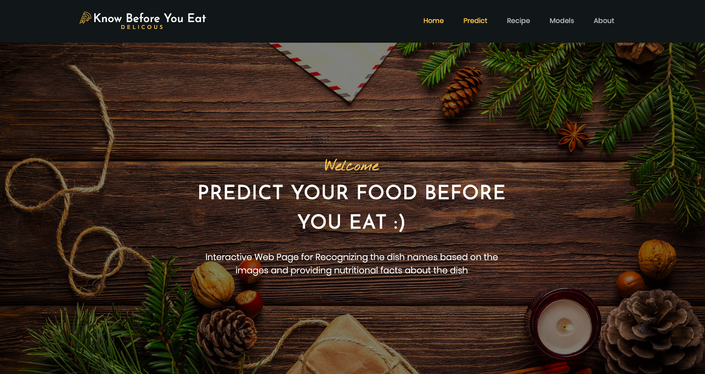

# Know-Before-You-Eat
An Interactive web application for identifying food names based on the images, providing nutritional facts (For eg: calculating calories of the food you're eating) for diet advice and predicting the recipes based on the predicted food names.

# Team Members
1) Saranya 
2) Madhavi Namballa
3) Olga
4) Vaishnavi

## <ins> Final Deployed Application Link </ins>
<a href="http://34.94.205.236:5000/#About"> Know Before You Eat </a>

## <ins> Presentation Link </ins>
https://docs.google.com/presentation/d/1L3HPKQ_NltZVhTflytylM7TNFtg3tfW1BnI9JeCAXP4/edit?usp=sharing

## <ins> Source Data </ins>

1) Food101 Dataset
https://www.vision.ee.ethz.ch/datasets_extra/food-101/

2) Nutritional Facts 
https://www.fatsecret.com/calories-nutrition/
http://ahealthylifeforme.com

3) Recipe
https://www.kaggle.com/kaggle/recipie-ingredients-dataset
https://en.wikipedia.org/wiki/

## <ins> Tools/Models Reference </ins>

1) Classification/Training Models

   > Transfer Learning With MobileNet 
   
   > Transfer Learning With VGG16
   
   > KNN & Random Forest

2) Keras Image Data Generator for Image Augmentation

3) Front End Application - HTML, CSS, Bootstrap and Javascript

4) Retrieving Data From Back End : Python (SQLAlchemy and Flask)

5) Missing Link AI - Platform to Run deep learning experiments on hundreds of machines, on and off the cloud, manage huge data sets and gain unprecedented visibility into your experiments.
https://missinglink.ai/

6) Application Deployment - Google Cloud (Computing Engine by creating VM Instance) 

